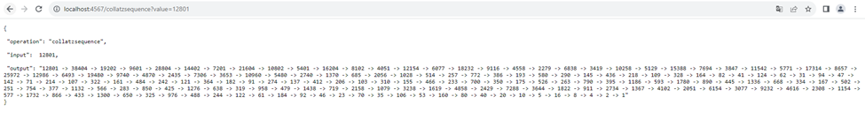
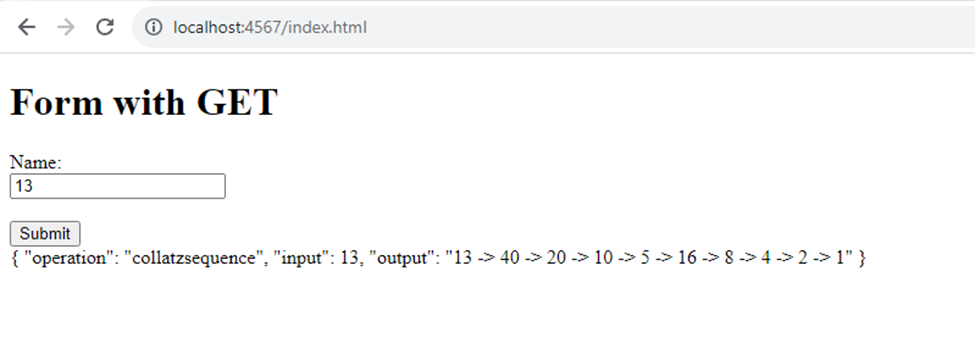
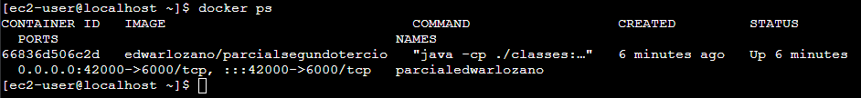
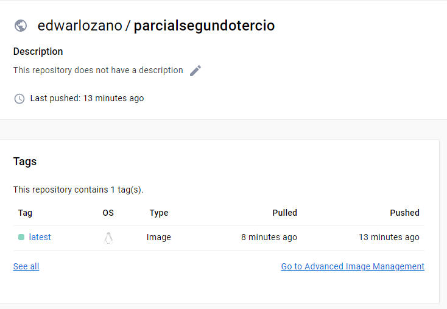
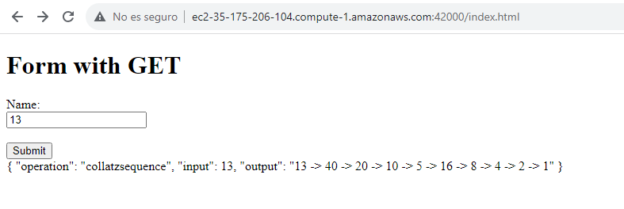
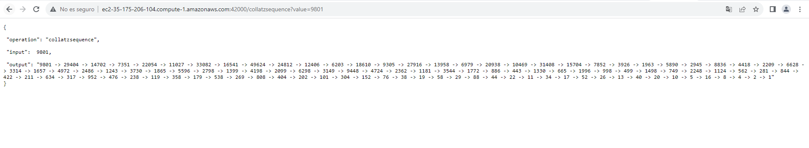

# Parcial 2
**Estudiante:** Edwar Fabian Lozano Florez  
**Clase:** AREP  
**Profesor:** Luis Daniel Benavides

## Como funciona
1. Primero se debe clonar el repositorio: https://github.com/EdwarLozano/ParcialEdwarLozano.git
2. Luego se debe realizar el siguiente comando en la carpeta raíz
```
    mvn clean install
```
3. Ahora debe ejecutar este, lo que le permitirá verificar que el proyecto funciona correctamente en local

En windows:

```
java -cp "target/classes;target/dependency/*" org.example.RestService
```

En Linux:

```
java -cp "target/classes:target/dependency/*" org.example.RestService
```

Luego, puede acceder a la ruta:

http://localhost:4567/index.html para el formulario o http://localhost:4567/collatzsequence?value=9801 para agregar el valor desde el enlace




## Evidencia funcionamiento

La instancia ec2 y corriendo el contenedor docker:



Imagen en docker hub:


Accediendo a:  http://ec2-35-175-206-104.compute-1.amazonaws.com:42000/index.html


Ejemplo de llamado desde URL en aws: http://ec2-35-175-206-104.compute-1.amazonaws.com:42000/collatzsequence?value=9801



## Nota
En la carpeta llave se encuentra la llave de la instancia

## Video
Se puede acceder en: https://drive.google.com/file/d/11IjRF1XPIhjnH6Wr3sPNvZQZFrdHFSnN/view?usp=sharing
